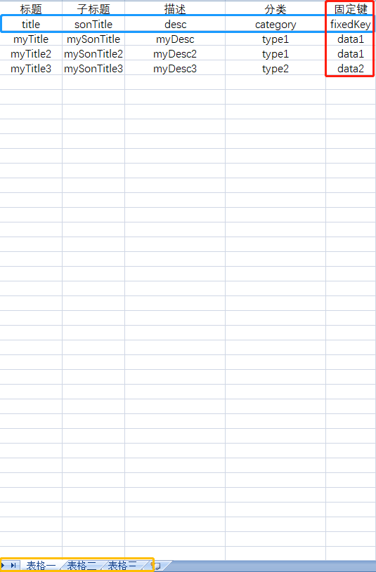

# `excel-to-json`
将`Excel`数据配置表格转换成`Json`数据，方便数据维护

适用场景：
- 静态商场首页，可用表格每次更新不同商品数据，再生成最新`json`更新到服务器即可
- `H5`中一些静态数据的展示，例如每期更新`banner`位置广告等，可免去后台开发成本
- 可方便配置页面中每块区域要展示的数据

**特点：**  
生成的数据格式为：`{name: 'config', data1: [], data2: []}`
- 以键值对方式存在，可读性高，更方便取值
- 数据会提取表格内相同的字段，作为数据的`key`，这样可以更好的配置页面中每一块的数据

## 用法说明
1. `npm i` 先安装依赖
2. `npm run create`，可以输出`json`格式的表格数据

## 方法入参说明
|  参数名称  | 类型 | 默认值 | 说明  
|  :-:  | :-: | :-: | --- |
| `startRow`  |`Number` | `2` | `json`数据从`Excel`表格哪一行开始取值
| `importPath`  |`String` | `../excel/` | 表格存放的路径 
| `excelFileName` |`String` | 配置文件 | 要编译的`Excel`表格文件名 
| `outPath` |`String` |`../json/` | 输出的`json`文件路径 |
| `outJsonName` |`Array` | `['data1', 'data2', 'data3']` | 输出名为`data1,data2,data3`的`json`，若值为`''`，则输出的`json`的名字以`Sheet`里的命名为主
| `fixedKeyName` | `String` | `fixedKey` |  `Excel`表格内**必须有此字段的值**，这样才能将相同`fixedKey`值的数据归类

## 表格说明  


- **蓝色框**：输出的`json`数据里，每个数组里面的`key`值  
- **红色框**：输出的`json`数据里，每一个模块数据的`key`值，`json`会根据`fixedKeyName`的值去归类，具有相同的`fixedKeyName`值的，会被归为一类，并且以其作为`json`的`key`  
- **黄色框**：如果入参`outJsonName`不填，则输出的`json`则会以其名字命名  
- 如图所示，`startRow`的值为`2`，意为`json`会从表格第二行开始读取渲染，第一行只是为了方便看，所以加了对`key`值的中文描述，去掉第一行的话，`startRow`的值则为`1`

## 示例
以该图为表格

```javascript
// 先在Tool/index.js配置输出的json
const Tool = require('./createJsonTool');
Tool.create({
    startRow: 2,
    importPath: '../excel/',
    outPath: '../json/',
    outJsonName: ['data1', 'data2', 'data3'],
    excelFileName: '配置文件',
    fixedKeyName: 'fixedKey'
});
```

然后npm执行：
```
npm run create
```

最后得到的json数据为：
```json
// config1.json
{
    "xlsxName": "表格一",
    "data1": [{
        "title": "myTitle",
        "sonTitle": "mySonTitle",
        "desc": "myDesc",
        "category": "type1"
    }, {
        "title": "myTitle2",
        "sonTitle": "mySonTitle2",
        "desc": "myDesc2",
        "category": "type1"
    }],
    "data2": [{
        "title": "myTitle3",
        "sonTitle": "mySonTitle3",
        "desc": "myDesc3",
        "category": "type2"
    }]
},


// 表格二.json
{
    "xlsxName": "表格二",
    "data1": [{
        "title": "myTitle",
        "sonTitle": "mySonTitle",
        "desc": "myDesc",
        "category": "type1"
    }, {
        "title": "myTitle2",
        "sonTitle": "mySonTitle2",
        "desc": "myDesc2",
        "category": "type1"
    }],
    "data2": [{
        "title": "myTitle3",
        "sonTitle": "mySonTitle3",
        "desc": "myDesc3",
        "category": "type2"
    }]
}

// config3.json
{
    "xlsxName": "表格三",
    "data1": [{
        "title": "myTitle",
        "sonTitle": "mySonTitle",
        "desc": "myDesc",
        "category": "type1"
    }, {
        "title": "myTitle2",
        "sonTitle": "mySonTitle2",
        "desc": "myDesc2",
        "category": "type1"
    }],
    "data2": [{
        "title": "myTitle3",
        "sonTitle": "mySonTitle3",
        "desc": "myDesc3",
        "category": "type2"
    }]
}
```
---
#### 此工具是自己平时项目中有用到，所以特意总结拿出来。如果觉得对你项目有帮助，欢迎点个小`Star`~